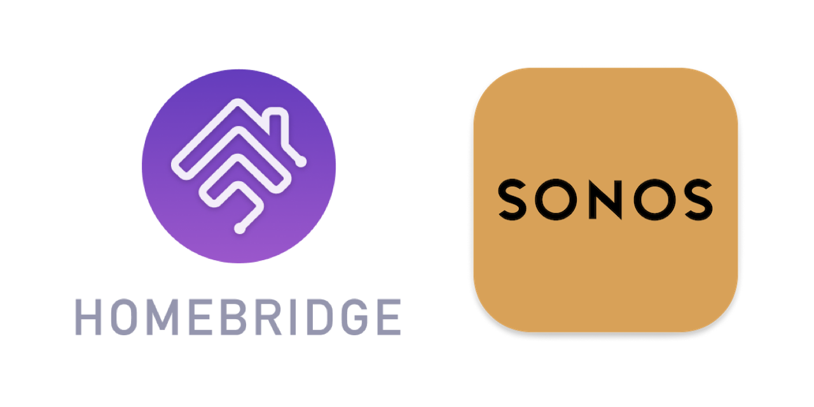

<p align="center">
    
</p>
<span align="center">

# Homebridge ZP
[](https://www.npmjs.com/package/homebridge-zp)
[](https://www.npmjs.com/package/homebridge-zp)
[](https://discord.gg/3qFgFMk)
[](https://github.com/homebridge/homebridge/wiki/Verified-Plugins)

[](https://github.com/ebaauw/homebridge-zp/issues)
[](https://github.com/ebaauw/homebridge-zp/pulls)
[](https://standardjs.com)
[](https://www.paypal.me/ebaauw/EUR)

</span>

## Homebridge plugin for Sonos ZonePlayer
Copyright © 2016-2020 Erik Baauw. All rights reserved.

This [Homebridge](https://github.com/homebridge/homebridge) plugin exposes [Sonos](http://www.sonos.com) ZonePlayers to Apple's [HomeKit](http://www.apple.com/ios/home/).
It provides the following features:
- Automatic discovery of Sonos zones, taking into account stereo pairs and home theatre setup;
- Support for Sonos groups, created through the Sonos app;
- Control from HomeKit of play/pause, sleep timer, next/previous track, volume, and mute per Sonos group;
- Control from HomeKit of input selection per group, from Sonos favourites and local sources, like LineIn, Airplay;
- Optional control from HomeKit of volume, mute, balance, bass, treble, loudness, night sound, and speech enhancement per Sonos zone;
- Optional control from HomeKit for Sonos zones leaving Sonos groups, and for Sonos zones creating/joining one Sonos group;
- Optional control from HomeKit to enable/disable Sonos alarms;
- Real-time monitoring from HomeKit of state per Sonos group and, optionally, per Sonos zone.
Like the Sonos app, Homebridge ZP subscribes to ZonePlayer events to receive notifications;
- Optional control from HomeKit for the status LED and child lock per ZonePlayer.
Note that Sonos doesn't support events for these, so Homebridge ZP cannot provide real-time monitoring for this;
- Includes command-line tools, for controlling Sonos ZonePlayers and for troubleshooting.

### Prerequisites
You need a server to run Homebridge.
This can be anything running [Node.js](https://nodejs.org): from a Raspberry Pi, a NAS system, or an always-on PC running Linux, macOS, or Windows.
See the [Homebridge Wiki](https://github.com/homebridge/homebridge/wiki) for details.
I run Homebridge ZP on a Raspberry Pi 3B+.

To interact with HomeKit, you need Siri or a HomeKit app on an iPhone, Apple Watch, iPad, iPod Touch, or Apple TV (4th generation or later).
I recommend to use the latest released versions of iOS, watchOS, and tvOS.  
Please note that Siri and even Apple's [Home](https://support.apple.com/en-us/HT204893) app still provide only limited HomeKit support.
To use the full features of Homebridge Zp, you might want to check out some other HomeKit apps, like the [Eve](https://www.evehome.com/en/eve-app) app (free) or Matthias Hochgatterer's [Home+](https://hochgatterer.me/home/) app (paid).

As Sonos uses UPnP to discover the ZonePlayers, the server running Homebridge must be on the same subnet as your Sonos ZonePlayers.
As HomeKit uses Bonjour to discover Homebridge, the server running Homebridge must be on the same subnet as your iDevices running HomeKit.
For remote access and for HomeKit automations, you need to setup an Apple TV (4th generation or later), HomePod, or iPad as [home hub](https://support.apple.com/en-us/HT207057).

### Zones
Homebridge ZP creates an accessory per Sonos zone, named after the zone, e.g. *Living Room Sonos* for the *Living Room* zone.
By default, this accessory contains a single `Switch` service, with the same name as the accessory.  The standard `On` characteristic is used for play/pause control.
Additional characteristics control volume, select input, change track, etc.
However, neither Apple's Home app nor Siri support these.

To control the volume from Apple's Home app and/or Siri, the type of the service, as well as the type of characteristic used for volume can be changed from `config.json`, see [**Configuration**](#configuration) and [issue #10](https://github.com/ebaauw/homebridge-zp/issues/10).
Note that speaker support in Apple's Home app is based on the AirPlay2 protocol.
Despite the "HomeKit" branding, technically, this has nothing to do with HomeKit.
No Homebridge plugin can expose speakers that look like AirPlay2 speakers in the Home app.
Also note that these Airplay2 speakers cannot be accessed by other HomeKit apps.

When `"tv": true` is set in `config.json`, Homebridge ZP creates an additional *Television* accessory per zone, allowing input selection from Apple's Home app and control from the *Remote* widget.
Note that Apple has imposed some technical restrictions on *Television* accessoies:
- They cannot be bridged; they need to be paired to HomeKit individually (like video cameras).
- They cannot be accessed by HomeKit apps; only from Apple's Home app.

### Groups
When multiple Sonos zones, e.g. *Living Room* and *Kitchen*, are grouped into one Sonos group, the Sonos app shows them as a single room, e.g. *Living Room + 1*, with shared control for play/pause, music source, and (group) volume and mute.
When this group is broken, each zone forms a separate standalone group, containing only that zone.
The Sonos app shows each standalone group as a separate room, with separate control per room for play/pause, music source, and (zone) volume and mute.

If Homebridge ZP would mimic this behaviour, dynamically creating and deleting accessories for groups, HomeKit would lose the assignment to HomeKit rooms, groups, scenes, and automations, every time an accessory is deleted.
Consequently, you would have to reconfigure HomeKit each time you group or ungroup Sonos zones.

To overcome this, Homebridge ZP creates an accessory and corresponding service for each Sonos zone.  This service actually controls the Sonos *group* the zone is in rather than the zone.
When separated, the *Living Room Sonos* service controls the standalone *Living Room* group, consisting of only the *Living Room* zone; and the *Kitchen Sonos* service controls the standalone *Kitchen* group, consisting of only the *Kitchen* zone.
When grouped, both the *Living Room Sonos* service and the *Kitchen Sonos* service control the multi-zone *Living Room + 1* group, containing both the *Living Room* and *Kitchen* zones.
The `Sonos Group` characteristic shows which group the zone belongs to, or rather: the name of the group coordinator zone, in this example: *Living Room*.

So when grouped, changing the *Living Room Sonos* `Volume` changes the volume of both the *Living Room* zone and the *Kitchen* zone.
So does changing the *Kitchen Sonos* `Volume`.
When ungrouped, changing the *Living Room Sonos* `Volume` only changes the volume of the *Living Room* zone; and changing the *Kitchen Sonos* `Volume` only changes the volume of the *Kitchen* zone.

### Speakers
To change the volume of an individual zone in a multi-zone group, an additional `Volume` characteristic is needed for the zone, next to the `Volume` characteristic for the group.
As HomeKit doesn't support multiple characteristics of the same type per service, it actually requires an additional service.
By specifying `"speakers": true` in `config.json`, Homebridge ZP creates an additional *Speakers* service for each zone accessory, to control the individual zone.  This service is named after the zone as well, in our example: *Living Room Speakers*.

The *Speakers* service `On` characteristic is used to join, or leave a Sonos group.
`On` is set, when the zone is a member of other zone's group.
It is clear, when the zone is the coordinator of it's own group (either standalone or with other zones as member).
By setting `On`, the zone will join groups with the target coordinator.
The target coordinator is set using the `Sonos Coordinator` characteristic in the *Sonos* service.
By clearing `On`, the zone will leave the group and become coordinator of a standalone group.

Additional characteristics for `Volume`, `Mute`, `Bass`, `Treble`, and `Loudness` control the corresponding zone attributes.
Note that `Bass`, `Treble`, and `Loudness` are custom characteristics.  They might not be supported by all HomeKit apps, see **Caveats** below.

Like the *Sonos* service, the type of the *Speakers* service can be changed in `config.json` from the default `Switch`.

### Command-Line Tool
Homebridge ZP includes a command-line tool, `zp`, to interact with your Sonos Zone Players from the command line.
It takes a `-h` or `--help` argument to provide a brief overview of its functionality and command-line arguments.

### Installation
To install Homebridge ZP:
- Follow the instructions on the [Homebridge Wiki](https://github.com/homebridge/homebridge/wiki) to install Node.js and Homebridge;
- Install the Homebridge ZP plugin through Homebridge Config UI X or manually by:
  ```
  $ sudo npm -g i homebridge-zp
  ```
- Edit `config.json` and add the `ZP` platform provided by Homebridge ZP, see [**Configuration**](#configuration).

### Configuration
In Homebridge's `config.json` you need to specify Homebridge ZP as a platform plugin:
```json
  "platforms": [
    {
      "platform": "ZP"
    }
  ]
```
The following optional parameters can be added to modify Homebridge ZP's behaviour:

Key | Default | Description
--- | ------- | -----------
`address` | _(discovered)_ | The IP address for the web server Homebridge ZP creates to receive notifications from Sonos ZonePlayers.  This must be an IP address of the server running Homebridge ZP, reachable by the ZonePlayers.  You might need to set this on a multi-homed server, if Homebridge ZP binds to the wrong network interface.
`alarms` | `false` | Flag whether to expose an additional service per Sonos alarm.
`brightness` | `false` | Flag whether to expose volume as `Brightness` when `service` is `"switch"` or `"speaker"`.  Setting this flag enables volume control from Siri, but not from Apple's Home app.
`excludeAirPlay` | `false` | Flag whether not to expose ZonePlayers that support Airplay, since they natively show up in Apple's Home app.
`forceS2` | `false` | Flag whether to expose only S2 zone players.  See [**Split Sonos System**](#split-sonos-system) below.
`heartrate` | (disabled) | Interval (in seconds) to poll ZonePlayer when `leds` is set.
`leds` | `false` | Flag whether to expose an additional *Lightbulb* service per zone for the status LED.  This also supports locking the physical controls.
`nameScheme` | `"% Sonos"` | The name scheme for the HomeKit accessories.  `%` is replaced with the player name.  E.g. with the default name scheme, the accessory for the `Kitchen` zone is set to `Kitchen Sonos`.  Note that this does _not_ change the names of the HomeKit services, used by Siri.
`port` | `0` _(random)_ | The port for the web server Homebridge ZP creates to receive notifications from Sonos ZonePlayers.
`resetTimeout` | `500` | Timeout (in milliseconds) to reset input (e.g. _Change Volume_).
`service` | `"switch"` | Defines what type of service and volume characteristic Homebridge ZP uses.  Possible values are: `"switch"` for `Switch` and `Volume`; `"speaker"` for `Speaker` and `Volume`; `"light"` for `LightBulb` and `Brightness`; and `"fan"` for `Fan` and `Rotation Speed`.  Selecting `"light"` or `"fan"` enables changing the Sonos volume from Siri and from Apple's Home app.  Selecting `"speaker"` results in a *not supported* accessory in Apple's Home app.
`speakers` | `false` | Flag whether to expose a second *Speakers* service per zone, in addition to the standard *Sonos* service, see [**Speakers**](#speakers).  You might want to set this if you're using Sonos groups in a configuration of multiple Sonos zones.
`subscriptionTimeout` | `30` | The duration (in minutes) of the subscriptions Homebridge ZP creates with each ZonePlayer.
`timeout` | `15` | The timeout (in seconds) to wait for a response from a Sonos ZonePlayer.
`tv` | `false` | Create an additional, non-bridged TV accessory for each zone.
`tvPreFix` | `TV` | Prefix for serial number of TV accessories, to enable multiple instances of Homebridge ZP on the same network.

Below is an example `config.json` that exposes the *Sonos* and *Speakers* service as a HomeKit `Speaker` and volume as `Brightness`, so it can be controlled from Siri:
```json
  "platforms": [
    {
      "platform": "ZP",
      "service": "speaker",
      "brightness": true,
      "speakers": true
    }
  ]
```

#### Split Sonos System

If you have a split Sonos system, Homebridge ZP will expose either the S2 or the S1 zone players, depending on which player is quickest to respond during discovery.
Usually this will be a restored S2 player, but there's no guarantee, especially after clearing the cached accessories.
This could cause HomeKit to drop accessories, treating them as new accessories when re-exposed, losing any association to HomeKit rooms, groups, scenes, and automations.
To prevent this, set `forceS2` in `config.json`.

To expose both the S2 and the S1 zone players, create two platform entries:
```json
"platforms": [
  {
    "platform": "ZP",
    "forceS2": true
  },
  {
    "platform": "ZPS1"
  }
]
```

### Troubleshooting

#### Check Dependencies
If you run into Homebridge startup issues, please double-check what versions of Node.js and of Homebridge have been installed.
Homebridge ZP has been developed and tested using the [latest LTS](https://nodejs.org/en/about/releases/) version of Node.js and the [latest](https://www.npmjs.com/package/homebridge) version of Homebridge.
Other versions might or might not work - I simply don't have the bandwidth to test these.

#### Run Homebridge ZP Solo
If you run into Homebridge startup issues, please run a separate instance of Homebridge with only Homebridge ZP (and Homebridge Config UI X) enabled in `config.json`.
This way, you can determine whether the issue is related to Homebridge ZP itself, or to the interaction of multiple Homebridge plugins in your setup.
You can start this separate instance of Homebridge on a different system, as a different user, or from a different user directory (specified by the `-U` flag).
Make sure to use a different Homebridge `name`, `username`, and (if running on the same system) `port` in the `config.json` for each instance.

#### Debug Log File
Homebridge ZP outputs an info message for each HomeKit characteristic value it sets and for each HomeKit characteristic value change notification it receives.
When Homebridge is started with `-D`, Homebridge ZP outputs a debug message for each request it makes to a Sonos ZonePlayer and for each ZonePlayer notification event it receives.

To capture these messages into a log file do the following:
- If you're running Homebridge as a service, stop that service;
- Run Homebridge manually, capturing the output into a file, by issuing:
  ```
  $ homebridge -CD 2>&1 | tee homebridge.log
  ```
- Interact with your devices, through their native app and or through HomeKit to trigger the issue;
- Hit interrupt (ctrl-C) to stop Homebridge;
- If you're running Homebridge as a service, restart the service;
- Compress the log file by issuing:
  ```
  $ gzip homebridge.log
  ```

#### Web Server
Like the Sonos app, Homebridge ZP subscribes to the ZonePlayer events to be notified in real-time of changes.  It creates a web server to receive these notifications.  The IP address and port number for this listener are logged in a debug message, e.g.
```
[1/1/2020, 11:58:35 AM] [Sonos] listening on http://192.168.x.x:58004/notify
```
To check whether the listener is reachable from the network, open this URL in your web browser.  You should see an overview of the active subscriptions per ZonePlayer.

#### Getting Help
If you have a question, please post a message to the **#zp** channel of the Homebridge community on [Discord](https://discord.gg/3qFgFMk).

If you encounter a problem, please open an issue on [GitHub](https://github.com/ebaauw/homebridge-zp/issues).
Please **attach** a copy of `homebridge.log.gz` to the issue, see [**Debug Log File**](#debug-log-file).
Please do **not** copy/paste large amounts of log output.

### Caveats
Homebridge ZP is a hobby project of mine, provided as-is, with no warranty whatsoever.  I've been running it successfully at my home for years, but your mileage might vary.

The HomeKit terminology needs some getting used to.
An _accessory_ more or less corresponds to a physical device, accessible from your iOS device over WiFi or Bluetooth.
A _bridge_ (like Homebridge) is an accessory that provides access to other, bridged, accessories.
An accessory might provide multiple _services_.
Each service corresponds to a virtual device (like a lightbulb, switch, motion sensor, ..., but also: a programmable switch button, accessory information, battery status).
Siri interacts with services, not with accessories.
A service contains one or more _characteristics_.
A characteristic is like a service attribute, which might be read or written by HomeKit apps.
You might want to checkout Apple's [HomeKit Accessory Simulator](https://developer.apple.com/documentation/homekit/testing_your_app_with_the_homekit_accessory_simulator), which is distributed as an additional tool for `Xcode`.

The Sonos terminology needs some getting used to.
A _zone_ corresponds to a physical room.
It consists of a single ZonePlayer, two ZonePlayers configured as a stereo pair, or a home theatre setup (e.g. a PlayBar with separate surround speakers).
Typically, zone setup is static; you would only change it when physically re-arranging your ZonePlayers between rooms.
A _zone group_ is a collection of one or more zones, playing the same music in sync.
A zone group is controlled by its _coordinator_ zone.
Typically, groups are dynamic, you add and/or remove zones to/from a group when listening to your music.
Controls for play/pause and music source act on a zone group.
Controls for volume and mute act on a zone group or on a single zone.
Controls for bass, treble, and loudness act on a single zone.
Note that Sonos uses the term _room_ ambiguously: on the Sonos app main screen it corresponds to a zone group, but in the Room Settings it corresponds to a zone.
